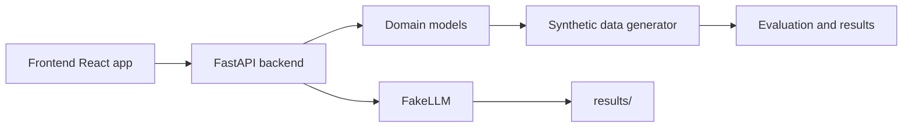

# Sentinel

Sentinel is a monorepo for an explainable fraud-triage system that compares a single tool-calling agent against simpler baselines. The project intentionally supports offline demo execution, transparent synthetic evaluation, and a reusable backend/frontend structure for future model and evaluation work.

## Current status

The repository now contains the initial full-stack foundation for the project described in the issue: a typed backend, synthetic data generation with a time-based split test, a fake offline LLM, a FastAPI app, and a React front-end that runs in offline demo mode without external API keys.

## Repository layout

- `backend/` – Python API and domain logic with a `src/` layout.
- `frontend/` – React + TypeScript + Vite UI.
- `docs/` – architecture and decision records.
- `results/` – generated evaluation artifacts.

## Quickstart

Prerequisites:

- Python 3.11+
- Node.js 20+
- `uv`

Set up the repo:

```bash
make setup
```

Run the offline demo app:

```bash
make dev
```

This starts the backend API and frontend app in demo mode using the fake provider by default. The configuration can be adjusted through `.env.example`.

## Architecture



## Data and evaluation model

The project uses synthetic transactions and a time-ordered split so the workflow remains reproducible and free of leakage across train/validation/test windows. The evaluation harness is designed around the issue requirements and emits results to the `results/` folder.

## Project standards

- Python config is strongly typed via `pydantic-settings`.
- UI state is managed in React and the app works in offline demo mode.
- The backend exposes health, case-list, case-detail, and comparison endpoints.
- Tests accompany the core synthetic-data and fake-LLM logic.

## Contributing

The project is intentionally structured to allow the phases described in the issue to be completed incrementally: synthetic data first, then evaluation, then a richer agent/tooling layer, and finally deeper frontend pages and reporting.
