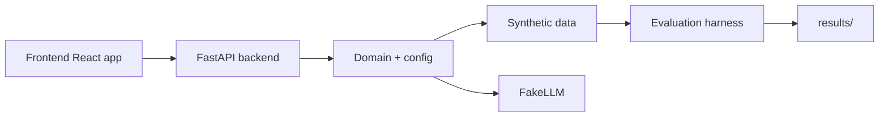

# README.md
# Sentinel

Sentinel is a monorepo for an explainable fraud-triage system that compares a single tool-calling agent against simpler baselines. The repository is intentionally structured for reproducible evaluation, offline demo use, and strict engineering operational standards.

## Project status

This repository is in its initial scaffold phase. The setup includes monorepo structure, typed Python and TypeScript configuration, pre-commit hooks, a FakeLLM, domain models, and a synthetic data generator with a time-based split test. These pieces are not a complete fraud model yet, but they give the project a stable foundation for the later phases described in the issue.

## Monorepo layout

- `backend/`: Python application with a `src/` layout.
- `frontend/`: React + TypeScript + Vite app.
- `docs/`: architecture and decision notes.
- `results/`: generated metrics and demo artifacts.

## Quickstart

Prerequisites:

- Python 3.11+
- Node.js 20+
- `uv`

Install dependencies and run the verification gates:

```bash
make setup
make check
```

Run the local demo services:

```bash
make dev
```

Use the offline demo mode by default via the `fake` LLM provider. A real provider can be enabled using the values in `.env.example`.

## Architecture



## Documentation

- `docs/architecture.md` includes the system design notes.
- `docs/decisions.md` records the chosen technical decisions for the initial setup.
- `docs/sources.md` will hold public references as the project advances.

## Contributing

The project follows a layered design with strict boundaries between domain logic, data generation, and future agent/evaluation components. Keep tests close to the relevant code and prefer small, focused modules.

