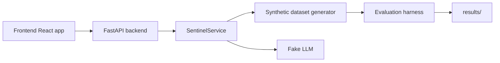

# Sentinel

Sentinel is a monorepo for an explainable fraud-triage system that compares a single tool-calling agent against simpler baselines. The repository is intentionally structured for reproducible evaluation, offline demo use, and strict engineering standards.

## Current status

The project now includes a more complete backend foundation, typed service boundaries, synthetic-data generation with a leakage-safe time split, fake offline LLM behavior, an API contract, and a front-end that consumes the case queue in demo mode.

## Repository structure

- `backend/` – Python services, domain models, synthetic data pipeline, and API routes.
- `frontend/` – React + TypeScript demo UI and typed API hooks.
- `docs/` – system architecture and design decisions.
- `results/` – generated evaluation artifacts.

## Quickstart

```bash
make setup
make dev
```

The backend defaults to the `fake` provider so the entire workflow runs without API keys.

## Architecture



## Notes

This is an operational foundation for the broader fraud-triage project. The synthetic data, API contract, and UI shell are in place, and the next phase is to extend this into the full evaluation pipeline and richer agent tooling described in the issue.
