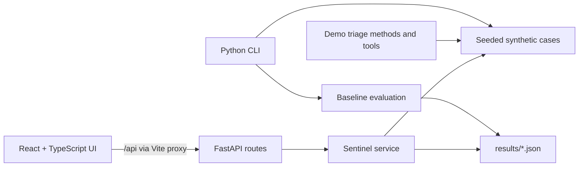

# Sentinel

Sentinel is a local prototype of a fraud-triage workspace. It generates synthetic transaction
cases, exposes them through a FastAPI service, and provides a React/TypeScript interface for
reviewing cases and inspecting a baseline evaluation artifact. It uses no employer or customer
data. The current model and LLM paths are demonstrations and must not be treated as validated
fraud-detection or security results.

## Current scope

The repository currently provides:

- Seeded synthetic transaction generation and time-ordered train/validation/test splitting.
- A deterministic, hand-coded risk-scoring baseline with feature-like attributions.
- A baseline evaluation command that writes JSON under `results/`.
- FastAPI routes for health, case queue, case detail, results, and model analysis.
- Per-request LLM selection for fake offline mode, Anthropic API, and local Ollama inference.
- A responsive React interface with an overview, searchable/filterable case queue, case detail,
  baseline results, LLM analysis, editable-memo injection demo, and provider settings.
- Offline fake-LLM responses so the demo does not require credentials or network access.

The LLM analysis screen sends case context and memo to the selected LLM provider. The injection
screen can submit an edited memo to that provider. These screens do not constitute a rigorous
multi-method experiment or a prompt-injection security test.

## Quickstart

Requirements: Python 3.11+, `uv`, Node.js 20+, and npm.

```bash
make setup
make check
make eval
make report
make dev
```

The frontend is at <http://localhost:5173>; the API is at <http://localhost:8000>. The Vite
development server proxies `/api` requests to FastAPI. The default provider is `fake`, so no
API key is needed. Use **LLM settings** in the app to select the Anthropic API or local Ollama:

- **Anthropic:** provide an API key and model name. The key remains in frontend memory for the
  current page session and is sent to the local backend with analysis requests; it is not stored
  in browser storage or the repository. Calls may incur provider charges. Do not use this local
  HTTP setup for a publicly exposed deployment; production use needs authenticated HTTPS and
  server-side secret management.
- **Ollama:** install and start Ollama, then pull a model, for example
  `ollama pull qwen2.5:3b`. By default Sentinel connects to
  `http://127.0.0.1:11434`; set `SENTINEL_OLLAMA_BASE_URL` in the backend environment if
  needed. No API key is sent.
- **Fake:** returns a placeholder and makes no provider call.

Run services separately if preferred:

```bash
cd backend && uv run uvicorn sentinel.api:app --reload --port 8000
cd frontend && npm run dev -- --port 5173
```

## Data and evaluation

The default dataset is generated locally by `SyntheticCaseGenerator`; it requires no downloads.
The generator uses a configurable seed and drift schedule. Splits are chronological. `make eval`
runs the current baseline evaluation and writes `results/baseline_demo.json`; `make report`
prints a short summary from that result file.

**Interpret results cautiously:** this is prototype evaluation code, not a research-grade
benchmark. The baseline is a manually specified scoring heuristic, not a trained gradient
boosted tree. The evaluation does not yet include bootstrap confidence intervals or the planned
injection, drift, faithfulness, tool-behavior, and ablation analyses. Operational latency and
cost fields must not be presented as production measurements. All synthetic scores are for
software demonstration only and should not be used to make real fraud decisions.

## Architecture



- `backend/src/sentinel/domain.py` contains transaction and case domain types.
- `backend/src/sentinel/data/` provides synthetic data and demo decisions.
- `backend/src/sentinel/tools.py` and `methods.py` contain local tools and demonstration
  implementations of the planned triage-method interface.
- `backend/src/sentinel/api.py` exposes HTTP endpoints; `service.py` contains service logic.
- `backend/src/sentinel/evaluation.py` calculates the current baseline metrics.
- `frontend/src/api.ts` is the shared API client; `frontend/src/hooks/` owns server state.
- `frontend/src/components/` contains reusable UI; `frontend/src/features/` contains
  overview, case review, comparison, injection-demo, and results screens.

## Development checks

```bash
make backend-test
make frontend-test
make check
cd frontend && npm run build
```

The backend uses Ruff and mypy; the frontend uses ESLint, TypeScript, Vitest, and Testing
Library. Backend and frontend dependencies are managed independently in their respective
directories.

## Limitations and planned work

This repository is a prototype and does not yet implement the full proposed system. Remaining
work includes a trained GBM and faithful explanations; a real LangGraph agent with injected,
guarded tools; LLM disk caching and budget enforcement; typed API schemas
and generated frontend contracts; statistically rigorous multi-method evaluations with
confidence intervals; actual injection, drift, faithfulness, and ablation suites; richer charts
and analyst workflows; import-boundary enforcement; and complete Docker/CI/fresh-clone
validation. The UI comparison and injection demo currently call an offline stub and deliberately
avoid claiming that those evaluations have been performed.

No proprietary data or code was used.
